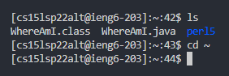

# Week 2 Lab Report

## Installing VSCode
- For installing VSCode, download it from [here](https://code.visualstudio.com/download) for Windows.
- Then, run the executable and follow the setup instructions.

## Remotely connecting
- Install [OpenSSH](https://docs.microsoft.com/en-us/windows-server/administration/openssh/openssh_install_firstuse).
- Look up your account for this course via [this tool](https://sdacs.ucsd.edu/~icc/index.php).
- Open the terminal using `Ctrl-[Backtick]`
- Type the following: `ssh cs15lsp22zz@ieng6.ucsd.edu`, where "zz" are replaced with the respective account name you got from the tool.
- Accept any messages you see (yes, then enter in your password).
- You should be logged into the remote server.

## Try some Commands
- Use any of the following commands: `ls`, `cd ~`, `ls -lat`, `ls -a`. 
- See what happens. You can run `[command] --help` to view information about each of them.

## Moving a file via SCP
- `Ctrl-D` and exit the remote server.
- Navigate to your file that you want to copy. 
- Use `scp [file path] [remote server]` to copy over the file. See the image below.

# SSH Keygen
- Type `ssh-keygen`. Accept the default options (do not enter a passphrase for this step).
- Then, add `ssh-keygen -t ed25519` (when running on Windows).
- This creates two files, a public and a private key.
- We will copy the public key over to the .ssh directory on your remote server.
- Log on to the server (follow the steps in "Remotely Connecting").
- Type `mkdir .ssh`. Then, run `scp /Users/<user-name>/.ssh/id_rsa.pub cs15lsp22zz@ieng6.ucsd.edu:~/.ssh/authorized_keys`.
- (Make sure to replace the parts above with your key path and your actual username.
- Once you do this, you can easily log in without using typing your password each time.

# Optimize Remote Running
- Once you have this down, try using the commands you got in "Try some Commands" to speed up your progress.
- See if you can optimize the keystrokes to make it as simple as possible.
- The example above should be the most optimal.

