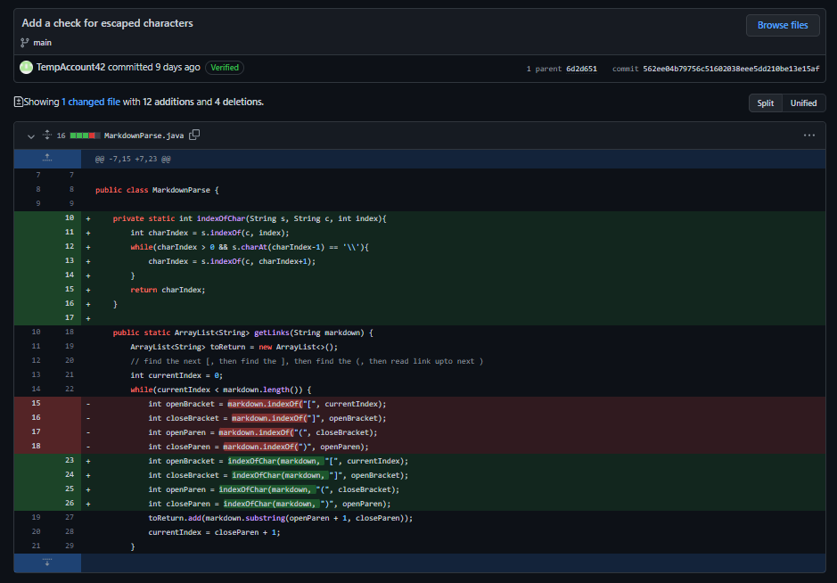
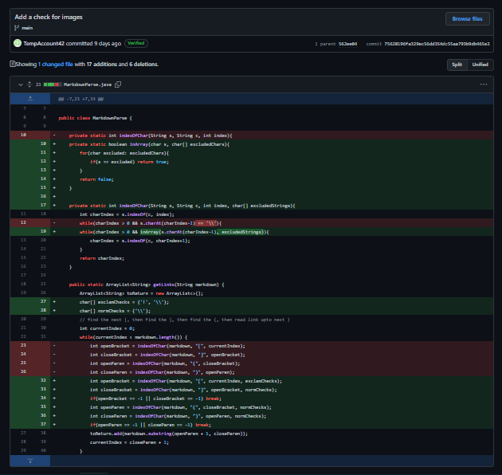
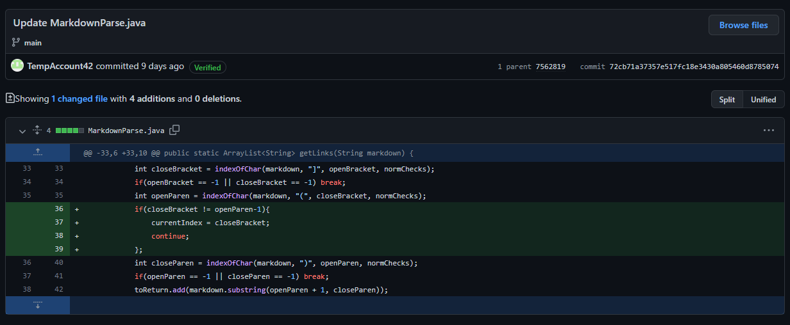

# Lab Report 2

## Bug 1: Escaped Characters

BREAKING FILE: [Test File 2](https://github.com/TempAccount42/markdown-parser/blob/main/test-file2.md)

- The symptom is the program failing to produce an output during a continous while loop as the file attempts to parse the link.
- The bug is the failure of the program to check for escaped characters. The input contains an escaped character in the link's name.
- This input causes the while loop to continously loop until the program is canceled.

## Bug 2: Image Checks

BREAKING FILE: [Test File 3](https://github.com/TempAccount42/markdown-parser/blob/main/test-file3.md)

- The symptom is the program producing an image link when an image is provided as an input.
- The bug is the failure of the program to check for an image markdown syntax. A failing input contains any image in markdown format.
- This input contains a single image of a cat, whose link is parsed.

## Bug 3: Brackets

- The symptom is the program collecting a link when the markdown link format isn't matched correctly, such as having a space between the paratheses and brackets.
- The bug is the failure of the program to check for spaces between paratheses and brackets existing. A failing input follows the form of `[Test] (Link)`.
- This input contains a misformatted link to Google.
