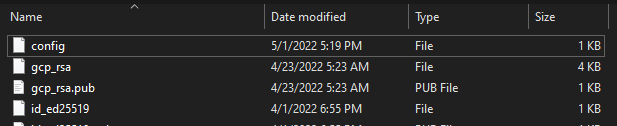
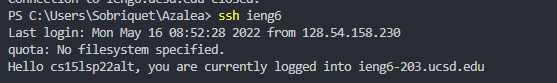
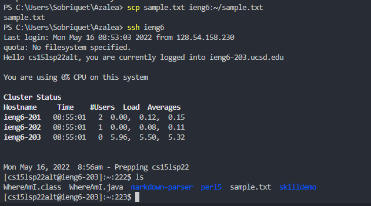

# Setting up a SSH Connection

## Utilizing .ssh/config
The `.ssh/config` file helps you minimize time by shortcutting the ssh string with an alias.

1) Type `WindowsKey-R`, then `.ssh` to open your `.ssh` folder. 
2) Open the config file. If there's not one already, create it: `config` with no file extension.



3) Right click, select Open With, and utilize a text editor to open the file. I use VSCode.

Add information following the format below.

```
Host ieng6
    HostName ieng6.ucsd.edu
    User cs15lsp22alt
```

4) Save the file. You should now be able to ssh using the alias.



## Utilizing SCP
The alias can help reduce time with things like transfering files.

1) Start on your local machine with a file you want to transfer.
2) Type `scp [file] [alias]:~/[filename]`.



Hope you found this guide helpful.
