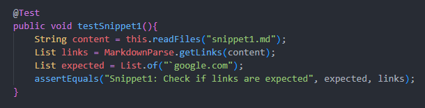
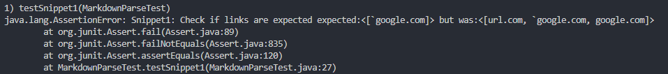
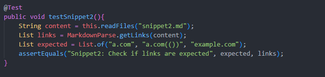
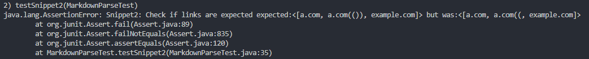
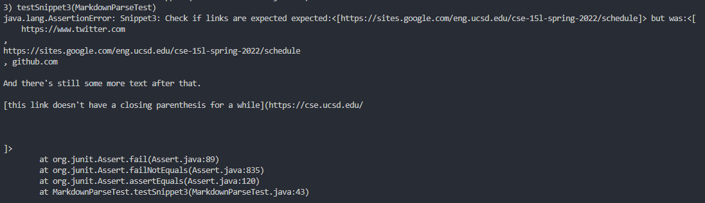

# Lab Report 4 - Week 6

Before we begin, we should introduce our two repositories.

- My repository: [TempAccount42](https://github.com/TempAccount42/markdown-parser)
- Week 7's repository: [Shresthhooda](https://github.com/Shresthhooda/markdown-parser)

Let's take a look at what the snippets should return. As per [Commonmark](https://spec.commonmark.org/dingus/), we should see the following links.

- Snippet 1 should have the link [\`google.com].
- Snippet 2 should have the links [a.com, a.com(()), example.com].
- Snippet 3 should have the links [https://sites.google.com/eng.ucsd.edu/cse-15l-spring-2022/schedule]

Alright. Here's how I implemented this with my repository, and the results.

## Snippet 1
Here's the implementation of my test.

The test did not succeed. Here is the failure message from JUnit.

I think it would be difficult to check for backticks with my code. I would likely have to implement a function to check for matching pairs and use it for backticks, which I imagine would take more than ten lines of code.

## Snippet 2
Here's the implementation of my test.

The test did not succeed. Here is the failure message from JUnit.

For this, I might be able to do it within 10 lines of code. I would simply have to check for parentheses being within the output, and make sure to parse carefully to avoid it.

## Snippet 3
Here's the implementation of my test.

The test did not succeed. Here is the failure message from JUnit.

This shouldn't be too bad. If I check for linebreak characters `\n` in the message name, I would easily be able to determine valid and invalid hyperlinks.
