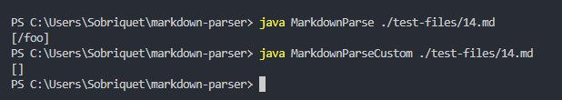
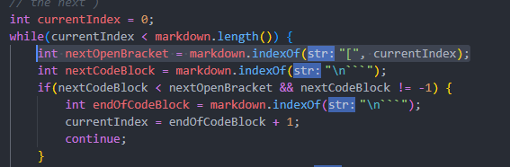
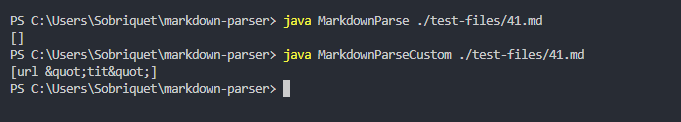

# LAB REPORT 5

Let's talk about the final lab report.

For my tests, I picked test [14.md](https://github.com/nidhidhamnani/markdown-parser/blob/main/test-files/14.md) and [41.md](https://github.com/nidhidhamnani/markdown-parser/blob/main/test-files/41.md).
Both these tests resulted in different outputs between my implementation and the 'official' implementation.

I picked these tests by outputting the result of my implemenation and the official MarkdownParse to the console, as well as the filename being compared (via shell script).
For efficiency, I only outputted a result if there was a link found.

Let's take a look at test 14.md first.

## 14.md
The official implementation outputs ``["/foo"]``. My implementation outputs ``[]``.

My output appears to be correct and the official implementation seems to have failed. Via the VSCode preview, ``/foo`` is not supposed to output as a link. The output should be ``[]``.

The bug within the official implementation is the failure to consider for escaped characters. ``\`` in the beginning of the first bracket means that the result should be escaped, and thus we should not output the link. To fix something like this, we should do a lookahead for ``\`` within our code.

Here is the area where the official implementation needs to be fixed.

## 41.md
The official implemenation outputs ``[]``. My implementation outputs ``[url &quot;tit&quot;]``.

The official output appears to be correct\* and my implemenation seems to have failed. Via the VSCode preview, the entire markdown piece should not output as a link. This is likely due to the ``&quot;`` instead of the ``"`` character, which does not work for Markdown hyperlink formatting. To fix something like this, we should check for a space in the url, but also check for the ``"`` character indicating there is mouseover text.

\* Though if we look at the official code, it is in fact incorrect in implementation — it fails to report the link because it includes a space, not because it uses ``&quot;``.

Here is the area where my implementation needs to be fixed.
[!Bugged Area for 41.md](Fix41.PNG)

That's all for the lab! Thanks for a great year.
